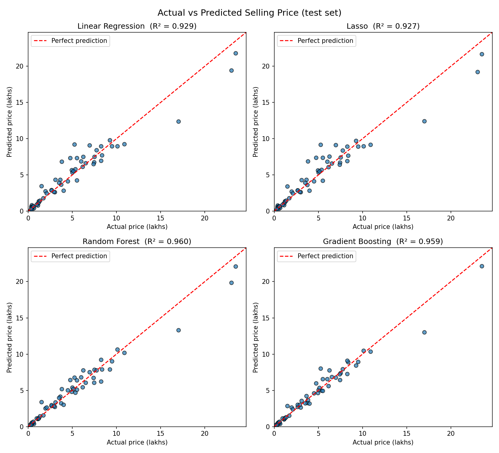
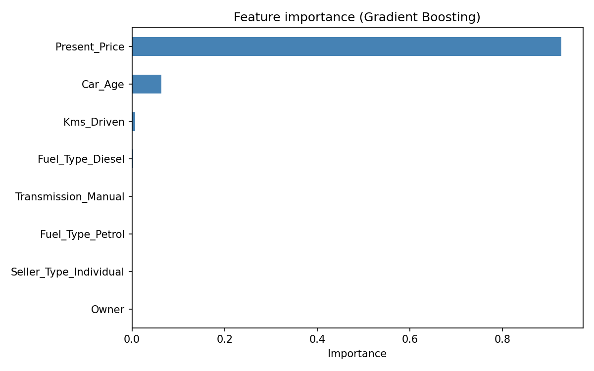

#  Used Car Price Prediction

A machine learning project that predicts the resale price of used cars from the [CarDekho dataset](https://www.kaggle.com/datasets/nehalbirla/vehicle-dataset-from-cardekho), comparing four regression models with scikit-learn pipelines and 5-fold cross-validation.



## Results

| Model | Test R² | 5-fold CV R² | Test MAE (lakhs) | Test RMSE (lakhs) |
|---|---|---|---|---|
| Random Forest | **0.960** | 0.882 ± 0.107 | 0.61 | **0.96** |
| Gradient Boosting | 0.959 | 0.898 ± 0.104 | **0.54** | 0.98 |
| Linear Regression | 0.929 | **0.945 ± 0.021** | 0.80 | 1.28 |
| Lasso | 0.927 | 0.943 ± 0.023 | 0.81 | 1.29 |

**Key finding:** feature engineering mattered more than model choice. Converting year to car age and log-scaling skewed features raised plain Linear Regression from R² 0.84 to about 0.93. The tree models score highest on the test split, while the linear models are the most stable across folds.

## Approach

1. **Data:** 301 used-car listings (price in lakhs INR); no missing values.
2. **Feature engineering**
   - `Car_Age` derived from `Year`
   - Log-transform of the right-skewed `Present_Price` and `Kms_Driven`
   - One-hot encoding of `Fuel_Type`, `Seller_Type`, `Transmission`
   - Log-transformed target (`Selling_Price`)
3. **Models:** Linear Regression, Lasso, Random Forest, Gradient Boosting, each wrapped in a scikit-learn `Pipeline`, so preprocessing is fitted only on training data.
4. **Evaluation:** 80/20 train/test split plus 5-fold cross-validation, reporting R², MAE and RMSE.



## Run it

```bash
git clone https://github.com/<your-username>/used-car-price-prediction.git
cd used-car-price-prediction
pip install -r requirements.txt
python car_price_prediction.py
```

The script prints the comparison table, saves charts and a results CSV to `outputs/`, and runs an example prediction:

```python
predict_price(model, present_price=9.85, kms_driven=6900, year=2017)
# -> about 7.77 lakhs
```

## Project structure

```
├── car_price_prediction.py   # full pipeline: load → engineer → train → evaluate → plot
├── car_data.csv              # dataset
├── images/                   # charts used in this README
└── requirements.txt
```

## Next steps

- Extend to the larger CarDekho datasets (8,000+ cars with engine, power and torque data)
- Hyperparameter tuning with `GridSearchCV`
- Deploy as a simple web app with Streamlit

## Author

**Yahia**, Computer Science student at the Faculty of Computers and Informatics, Suez Canal University
